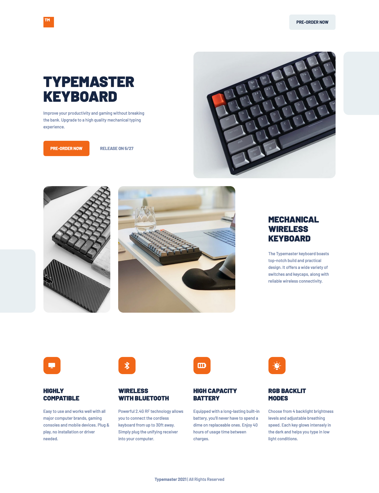

# Typemaster pre-launch landing page solution

This is a solution to the [Typemaster pre-launch landing page challenge on Frontend Mentor](https://www.frontendmentor.io/challenges/typemaster-prelaunch-landing-page-J6-Yj5J-X). Frontend Mentor challenges help you improve your coding skills by building realistic projects.

This project is a stylish pre-launch page for a keyboard product, built using HTML for structuring and CSS/Scss for modular styling. The focus is on creating an engaging user experience through design before the product's official launch.

## Links and Preview

| [Live Demo ULR](https://github.com/ionStici/typemaster-pre-launch-landing-page) | [Frontend Mentor](https://www.frontendmentor.io/solutions/typemaster-prelaunch-landing-page-u1IwxipZmn) |
| ------------------------------------------------------------------------------- | ------------------------------------------------------------------------------------------------------- |

<div />
<details>
<summary><b>Open Preview</b></summary>
<br>



<br>
</details>

## Features

-   **Modern Design:** A sleek, contemporary look that highlights the product's premium features.
-   **Responsive Layout:** The page is designed to look great on all devices, from mobile to desktop.
-   **Interactive Elements:** Includes subtle animations and hover effects to enhance user interaction.
-   **Product Showcase:** Features a gallery or sections to display different views or features of the Typemaster keyboard.

## Tech Stack

-   **HTML5:** For the semantic structure of the pre-launch landing page.
-   **CSS3 with Scss:** For efficient and organized styling, utilizing Scss for variables, mixins, and nested selectors to streamline the CSS.

## Getting Started

To get a local copy of the project and launch it, you need `npm` (which comes with Node.js) installed and the `live-server` package.

### Prerequisites

Install `live-server` globally:

```bash
npm install -g live-server
```

### Installation

```bash
# 1. Clone the project
git clone https://github.com/ionStici/typemaster-pre-launch-landing-page.git

# Navigate to project directory
cd typemaster-pre-launch-landing-page

# Install dependencies
npm install

# Launch the project live and open it on localhost:8000
npm run start
```

## License

This project is licensed under the MIT License. See [LICENSE](./LICENSE) file for more information.
